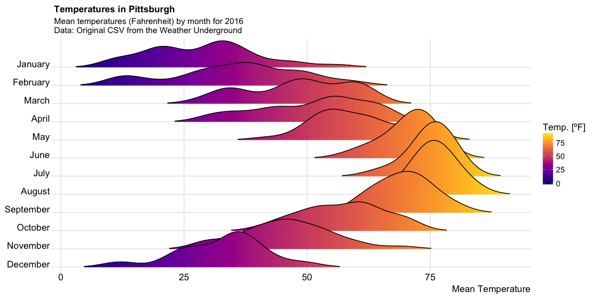
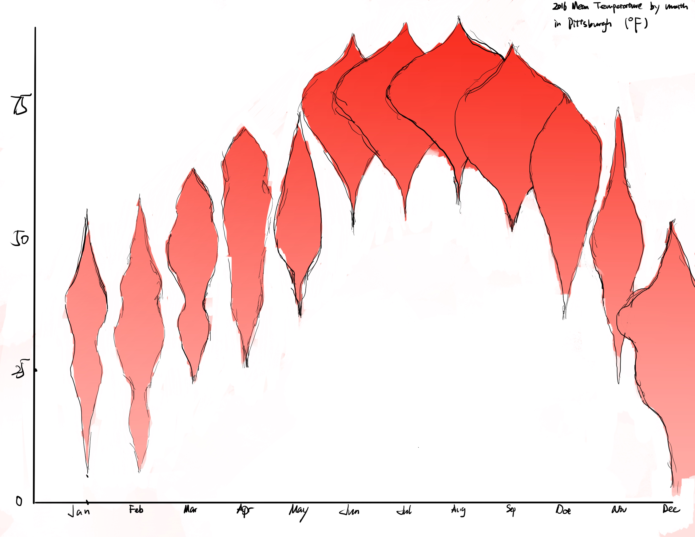

# Assignment 3 & 4: Critique by Design
## Step one: Find a data visualization

This is a graph I found on the web about the distribution of mean temperatures in Pittsburgh, and I found this plot to be highly informative and very interesting. But there are many things about this plot that could also be enhanced. 
source：[Weather Data, Plot, and Code](https://towardsdatascience.com/pgh-weather-data-plot-and-code-19d8e8b670f)
## Step two: Critique the data visualization

The first is that the color of this graph would grab my attention. The color is good from an aesthetic point of view, using an Instagram-like color scheme. But I would question how well this color scheme works when it comes to showing temperature. Using purple to show low temperatures and yellow to show high temperatures is not the accepted by default. 

Then, I would see the "valley" shaped part of each month, which I think is confusing to viewers. People may associate this shape with high and low temperatures, but after looking at the graph for a long time, they will understand that the area of the graph represents the density level of the daily mean temperature distribution over the month, and this graph is a "half violin graph". If I want to improve the graph and retain the density information, I may want to change the graph to a complete "violin graph". 

Finally, I would focus on the X, Y axis coordinates of this graph. Intuitively, the month as a unit of time we would want it to be horizontal; and the temperature we would usually want it to be vertical (like a thermometer). So, I might want to change these axes.

I think this tool is aimed at anyone who wants to know about the climate in Pittsburgh, and from that point of view, the graph somewhat conveys the climate message. But the part about density distribution is probably too specialized and not everyone has the background knowledge to read this graph.

## Step three: Wireframe a solution
I sketch to give my initial solution, and here is my sketch.

I started by switching the X,Y axis. I used the X-axis to represent the month, which fits the viewer's intuition, and the viewer can compare the temperature of different months horizontally. Then I used the Y-axis to indicate the temperature level. At the same time, I changed the graph to a "violin plot", which retains the density information while avoiding the one-way "valley" shape to distract the viewer's attention. I also changed the color to a gradient of red. I thought the red color would be associated with higher temperatures, while the lighter color would be associated with lower temperatures. Although I also think the color may not be needed at all in this place, since the Y-axis information already expresses the higher or lower temperature. But I think from an aesthetic perspective that this graph should have at least one color, which can also draw viewer's attention.
## Step four: Test the solution
I looked for comments on my sketch from viewers who did not have experience in data visualization. I didn't explain the sketches in any way to get a true sense of the audience's reaction, and after learning what the audience had to say about mine, I provided the original visualization in the hope of getting more different voices and to see if I was on the right track to improve it.

Viewers could generally capture the most basic information in this visual, which is the range of the mean temperature of each month. However, all the viewers were confused about what the image was trying to say about density, and no one could understand the meaning of the width of the shape of the image.

When I presented the original visual, some viewers said that when I used the X-axis to indicate the month, the viewers would misunderstand that the width of the image indicated the change of the weather of each day, and the repetition of the shape in the image would also bring misunderstanding to the viewers, which was also a problem in the original image. Some viewers also said that the information I presented in the violin chart was redundant, and that half of the shapes in the original visual could show the density information (after I explained that the width is to express the density).

In addition, some of the feedback I received included the need to enhance the gradient of the colors, change the violin chart to a box plot to represent the distribution of data, and widen the spacing between the graphs for each month.
## Step five: Build your solution
After taking all the feedbacks into account, I created this visualization using Flourish.

I think the biggest change is the elimination of the shape of the violin plot. I originally thought it was a very professional way to show the distribution of a data. But I found it too professional to be understandable. Therefore I simply used each circle to represent the distribution of the data. I adjusted the transparency of each circle so that when the circles are overlapped, it also shows the density distribution of the data.

However, I think there are still improvements that can be made to this visualization due to the limitations of my use of Flourish. First of all, I would like the legend to be vertical, so that it is in the same direction as the colors in the plot. Secondly, I think there are too many axes in the image, which makes it hard to pay attention to the trend visually. Lastly, I would like to add some changes in the shape of the circles where there is a high degree of overlap, so that the contrast between the months can be made.
