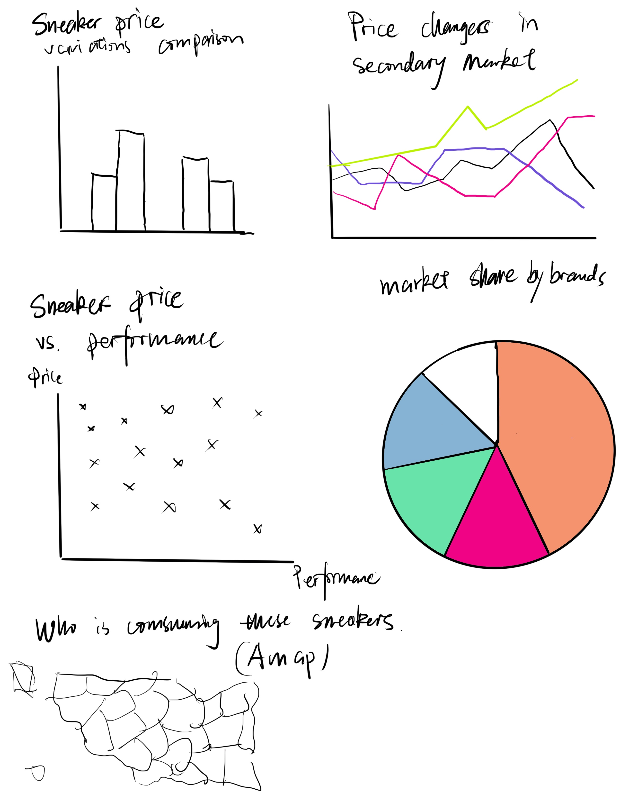

# Final Project Part 1
## Outline
Sneakers are very cool, and I hope to introduce everyone to the current situation of the sneaker market. A lot of sneakers have crazy prices, and I hope I can tell people about the reasons why sneakers are overpriced (e.g. consumerism and hype) through my project. Also, through this project I want to explore the relationship between performance and price which will help people have a rational consumption mindset.
## Sketches

## Data
There are many sneaker trading sites where data is available, such as ebay, stockx, goat, etc. There are also some websites that scrape and integrate these contents.

eg. [sneaker database](https://thesneakerdatabase.com/)

For sneaker performance data, I will use a database in reddit. There are many enthusiasts who test and organize data about sneakers.

eg. [sneaker performance](https://docs.google.com/spreadsheets/d/1LmMuhapV3gaJnHSd5S6ckeK3D5BZRiHejOQNvrB6dV4/edit?usp=sharing)
## Method and Medium
I think I'll end up using shorthand completely for this project, and for a better experience, I might look for some copyright-free images of sneakers and some pictures of players wearing them to make the content more attractive.
