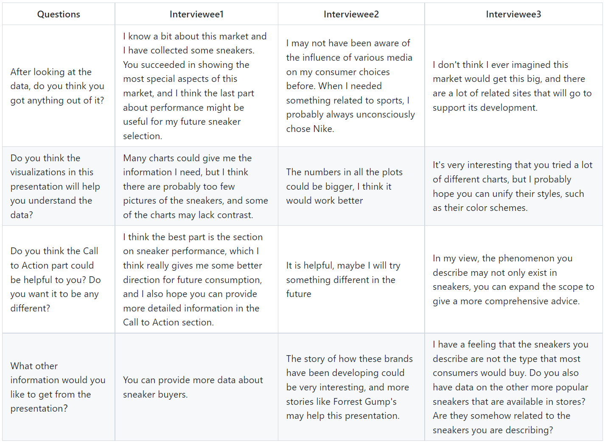

# Final Project Part2
## Wireframes and storyboards
<iframe src="https://preview.shorthand.com/nUxrxkLPEKWO1Q7J" width="100%" height="600" frameborder="0" scrolling="yes"></iframe>

## User research and interviews

#### a. Target Audience
Since the main target group of sneaker culture is young people, and my reason for trying to talk about this topic is that I hope people can understand this culture and treat this cultural phenomenon sensibly, so my target audience is Millennial and Generation Z.

#### b. Approach to identifying representative individuals to interview 
All my interviewees were my schoolmates, and all of them are at the same age as my target audience. According to the data, males are the main group of sneaker consumers, but I also interviewed some females in order to get a different perspective. Also, sneaker culture is understood differently in different countries' cultural backgrounds and economic environments, so I interviewed students from both the United States and China.

#### c. Interview script

#### d. Findings from interviews
I'm glad that my presentation is informative for most people. But my perspective may still be different than someone who doesn't know the topic at all. Sometimes what I think is normal may be difficult for others to understand. I may need more in storytelling.
#### e. Changes to be implemented
I think my story may have been polished, but it still needs to be optimized. Also a lot of the visual content needs to be better modified and I need to make them look more consistent. Some of the features of Shorthand I could explore more and what I need to do is to change some of the typography.
